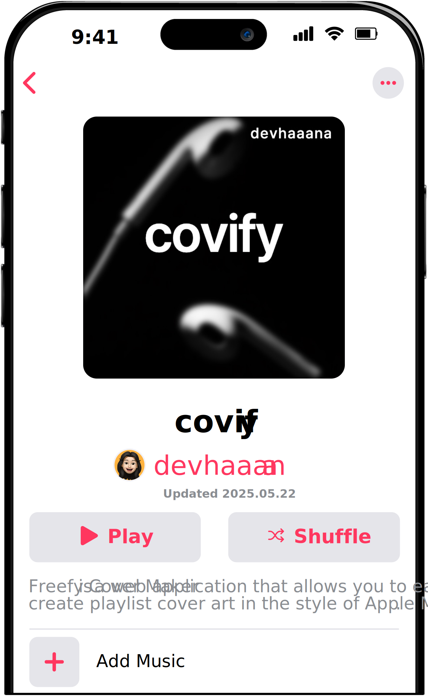

  

  
  
  
  

 

[ENGLISH](/README.md)  ·  [한국어](/documents/README-KR.md)  ·  [日本語](/documents/README-JP.md)

 

`Freefy Cover Maker` は、Apple Music スタイルのプレイリストカバーアートを簡単に作成できるウェブアプリケーションです。
テキスト、画像、カラーを組み合わせて、自分だけの感性あふれるプレイリストカバーを作成し、ダウンロードすることができます。
静的ウェブ技術を活用しており、軽量かつ高速に動作し、インストールなしでブラウザ上でそのまま使用できます。

## インデックス

- [インデックス](#インデックス)
- [警告](#警告)
- [技術](#技術)
- [はじめに](#はじめに)
  - [使用方法](#使用方法)
- [リリースファイル](#リリースファイル)

## 警告

**このプロジェクトを商業目的で使用しないでください。個人的な非商業的使用のみにご利用ください。**

**注意：** API の1時間あたりのリクエスト制限により、一部の機能が一時的に正常に動作しない場合があります。

## 技術

- `HTML`
- `CSS`
- `JS`

## はじめに

### 使用方法

以下のリンクからブラウザで Covify を利用できます：

[https://covify.vercel.app](https://covify.vercel.app/)

インストール不要で、テキスト・画像・カラーを組み合わせて、オリジナルのプレイリストカバーアートを作成・ダウンロードできます。

## リリースファイル

| ファイル  | 説明  |
| :-------------------------------------------------------------------------------------- | :----------------------------------------------------------------- |
| [covify-1.1.0.zip](https://github.com/devhaaana/covify/archive/refs/tags/v1.1.0.zip)       | covify v1.1.0 のソースコードを含む *ZIP* ファイル    |
| [covify-1.1.0.tar.gz](https://github.com/devhaaana/covify/archive/refs/tags/v1.1.0.tar.gz) | covify v1.1.0 のソースコードを含む *TAR.GZ* ファイル |